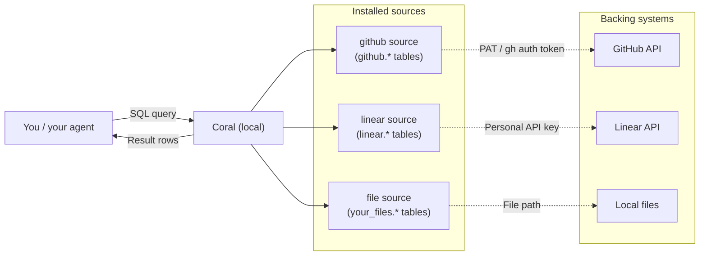

[](https://github.com/withcoral/coral/actions/workflows/validate.yml)
[](https://github.com/withcoral/coral/releases)
[](./LICENSE)
[](https://withcoral.com/docs)
[](https://withcoral.com/discord)
[](https://deepwiki.com/withcoral/coral)

Coral is a single SQL interface for APIs, files, and other data sources.

Agents make fewer, more precise tool calls with Coral than they do with
per-source MCP servers, CLI tools, or API wrappers. For agent read tasks, SQL
has a structural advantage when a question needs more than one API call: it
avoids paginating through large results, returns tabular rows instead of
sprawling JSON, brings back only the columns you asked for, and correlates
across sources in a single statement.

Everything is local: your data, credentials, and usage history never leave your
machine.

[](https://github.com/withcoral/coral/releases/latest/download/coral-desktop-mac-universal.dmg)
[](https://github.com/withcoral/coral/releases/latest/download/coral-desktop-linux-x86_64.AppImage)
[](https://github.com/withcoral/coral/releases/latest/download/coral-desktop-win-x64.exe)

Coral ships as a desktop app on macOS, Linux, and Windows. For servers and automation, use the [CLI](#cli-quickstart).

## Get started

1. **Install Coral.** Use a download above, or see
   [all installation options](https://withcoral.com/docs/getting-started/installation).
2. **Add your sources.** Connect GitHub, Slack, Datadog, and other
   [bundled sources](https://withcoral.com/docs/reference/bundled-sources) from
   the sources page. Coral only fetches data from sources you connect.
3. **Connect your agents over MCP.** The app exposes an MCP server over stdio.
   Point Claude Code, Codex, Cursor, or VS Code at it — see
   [Use Coral over MCP](https://withcoral.com/docs/guides/use-coral-over-mcp).

Then ask your agent a question about your data:


## Why Coral

Most agent workflows access company data one tool at a time. That works, but it
tends to create:

- too many tool calls
- repeated auth, pagination, and retry logic
- poor cross-source reasoning
- high token traffic
- brittle glue code and prompts

Coral gives agents one query interface instead:

- query multiple live sources through SQL
- keep workflows inspectable and scriptable
- expose the same runtime over MCP
- answer cross-source questions without stitching tools together by hand

We benchmarked Coral against direct provider MCPs (Datadog, Sentry, Linear, Slack, and GitHub) for a diverse set of 82 real-world AI tasks using Claude Opus 4.6. Key findings:

1. **Widespread impact on performance**. Across all tasks, Claude was 20% more accurate and 2x more cost efficient using Coral than using direct provider MCPs. With Coral, Claude also had 42% lower latency.

2. **Highest impact on coding agent tasks**. Across the more complex tasks that typify coding agent workloads (multi-hop, higher post-processing), Claude was 31% more accurate and 3.4x more cost efficient with Coral.

3. **More neutral impact on simpler tasks**. For simpler AI tasks, such as raw fact retrieval from knowledge bases, the results were closer, with Claude 6% more accurate and 2% more cost efficient with Coral.

Full [benchmark report](https://withcoral.com/benchmarks).

## How Coral works

Coral sits between your agents and your data sources: your agents write SQL,
and Coral translates it into API calls or file reads, then returns a single
result set.



**Sources.** A _source spec_ is a YAML file that declares how to reach an API
or local dataset and which tables and columns it exposes. A _source_ is that
spec plus the credentials and variables you configured for it. When you run
`coral source add github`, Coral installs the `github` source and exposes it
at query time as the `github` SQL schema, so tables like `github.issues` and
`github.pulls` become queryable. Start with the
[bundled sources](https://withcoral.com/docs/reference/bundled-sources) or
[write your own](https://withcoral.com/docs/guides/write-a-custom-source).

**Joins across sources.** Because every source appears as SQL tables, you can
`JOIN` across them in one statement, and Coral executes the join locally
after fetching each side from its backing API or files. For example, to see
which Linear issues are tracking open GitHub pull requests:

```sql
SELECT a.issue_identifier, a.url, p.state
FROM linear.attachments a
JOIN github.pulls p ON p.html_url = a.url
WHERE p.owner = 'withcoral' AND p.repo = 'coral'
```

**Authentication.** On `coral source add`, Coral reads variables and secrets
from matching environment variables, or prompts for them when you pass
`--interactive`. These values are stored locally and used only at query time;
credentials never leave your machine.

**Built for production.** Coral is a read layer by design. For read tasks, SQL
outperforms per-source tool calls when complexity outgrows a single API call:
Coral handles pagination, returns tabular rows instead of sprawling JSON, and
lets the query pick just the columns it needs. Query pushdown and caching
keep things responsive and cut unnecessary API traffic.

For a deeper understanding of the internals, see the
[architecture page](https://withcoral.com/docs/project/architecture).

## Sources

Coral bundles [popular data sources](https://withcoral.com/docs/reference/bundled-sources)
— Datadog, GitHub, Linear, Sentry, Slack, Stripe, and more — plus local JSONL
and Parquet files. Run `coral source discover` to see what your build bundles.

Many more [community source specs](https://withcoral.com/docs/reference/community-sources)
live in this repo under [`sources/community`](./sources/community) and import
with `coral source add --file`. Community sources do not appear in
`coral source discover`, and `coral source add <name>` installs bundled sources
only.

If neither covers what you need,
[write your own source spec](https://withcoral.com/docs/guides/write-a-custom-source),
or [tell us which source to add](https://github.com/withcoral/coral/issues/new).

## CLI quickstart

This walks the CLI path end to end, from a fresh
[install](https://withcoral.com/docs/getting-started/installation) to your
first SQL query. For the desktop app, see [Get started](#get-started) above.
If you prefer an interactive wizard, run `coral onboard`, which guides you
through everything covered below.

### 1. Install Coral

On macOS:

```bash
brew install withcoral/tap/coral
```

Or on Linux:

```bash
curl -fsSL https://withcoral.com/install.sh | sh
```

Or on Windows 10/11 x86_64, download
`coral-x86_64-pc-windows-msvc.zip` from the latest GitHub release and put
`coral.exe` on your `PATH`.

See [all install options](https://withcoral.com/docs/getting-started/installation).

### 2. Discover bundled sources

```bash
coral source discover
```

This lists the bundled sources available in your build.

### 3. Add a source

For example, add GitHub interactively:

```bash
coral source add --interactive github
```

Coral prompts for any required variables or secrets. For scripted setup, omit
`--interactive` and provide each input as an environment variable of the same
name, such as `GITHUB_TOKEN=ghp_... coral source add github`. Once connected,
the source's data is available as SQL tables. To update a source's credentials
later, run the same command again.

### 4. Query your data

Use `coral.tables` and `coral.table_functions` to see available query surfaces:

```bash
coral sql "SELECT schema_name, table_name FROM coral.tables ORDER BY 1, 2"
coral sql "SELECT schema_name, function_name FROM coral.table_functions ORDER BY 1, 2"
```

Assuming you've connected GitHub, try listing open issues for a repo:

```bash
coral sql "
  SELECT number, title, state, created_at
  FROM github.issues
  WHERE owner = 'withcoral' AND repo = 'coral' AND state = 'open'
  ORDER BY created_at DESC
  LIMIT 10
"
```


### Next steps

- **[Search with Coral](https://withcoral.com/docs/guides/search-with-coral)** — `coral search` finds where to query before you write SQL, across catalog metadata and the values Coral saw while querying your sources
- **[Use Coral over MCP](https://withcoral.com/docs/guides/use-coral-over-mcp)** — expose Coral to Claude Code, Cursor, or VS Code over MCP so your agent can query sources directly
- **[Write a custom source spec](https://withcoral.com/docs/guides/write-a-custom-source)** — connect any HTTP API or local dataset that isn't bundled yet
- **[Install Coral skills](https://withcoral.com/docs/getting-started/installation#skills)** — teach your coding agent how to use Coral

## Use Coral with an agent

Coral ships with a built-in MCP server that presents Coral to your agent as a
read-only SQL database. Once you've added at least one source, wire Coral into
your agent:

```bash
claude mcp add --scope user coral -- coral mcp-stdio   # Claude Code
codex mcp add coral -- coral mcp-stdio                 # Codex
```

For Cursor, VS Code, Claude Desktop, OpenCode, and manual config examples,
see [Use Coral over MCP](https://withcoral.com/docs/guides/use-coral-over-mcp).

Coral also publishes three skills that teach your agent the discovery-first
SQL workflow: `coral`, `coral-create-source-spec`, and
`coral-review-source-spec`.

```bash
npx skills add withcoral/skills
```

Once connected, ask your agent a question about your data. It should reach for
`search` first to find the right schemas and tables, fall back to the
`coral.tables`, `coral.table_functions`, and `coral.columns` metadata tables
for catalog discovery, then answer with SQL over the sources you connected.

## Local state

Coral stores local state in its platform-specific configuration directory.

You can override the config directory with:

```bash
export CORAL_CONFIG_DIR=/path/to/coral-config
```

Important files include:

- `config.toml` for runtime settings such as feature flags, tracing, and
  database bootstrap configuration
- `coral.db`, the default local Coral database for installed-source metadata,
  imported source specs, DSL v4 materialization metadata, feedback reports,
  trace summaries, encrypted credential documents, and non-secret variables
- `credentials/encryption.key`, the local key material used to protect
  encrypted credential documents
- `telemetry/traces`, the local raw trace span store when trace history is
  enabled

Bundled source specs are not copied into the config directory. Coral resolves
them from the current binary when you validate or query a bundled source, so
upgrades pick up newer bundled manifests without re-adding the source.

## Development

Install the local test runner once with Homebrew:

```bash
brew install cargo-nextest
```

Or install it with Cargo:

```bash
cargo install cargo-nextest --locked
```

Run the workspace validation gate from the repository root:

```bash
make rust-checks
```

## Documentation

For setup guides, reference docs, and examples, visit
[withcoral.com/docs](https://withcoral.com/docs).

## Community

Questions, ideas, and show-and-tell are welcome in our
[Discord](https://withcoral.com/discord) or on
[GitHub issues](https://github.com/withcoral/coral/issues).

## Contributing

Contributions are welcome, especially bug fixes, tests, documentation
improvements, source improvements, and user-facing usability improvements.

Please read [`CONTRIBUTING.md`](./CONTRIBUTING.md) before opening a pull
request.

## Security

Please do not report security issues in public issues or pull requests. See
[`SECURITY.md`](./SECURITY.md).

## Licence

Coral is licensed under the Apache License 2.0. See [`LICENSE`](./LICENSE).
