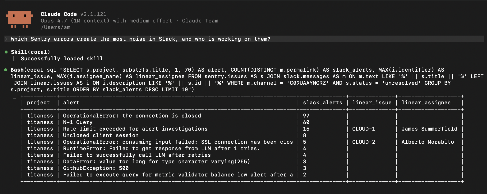
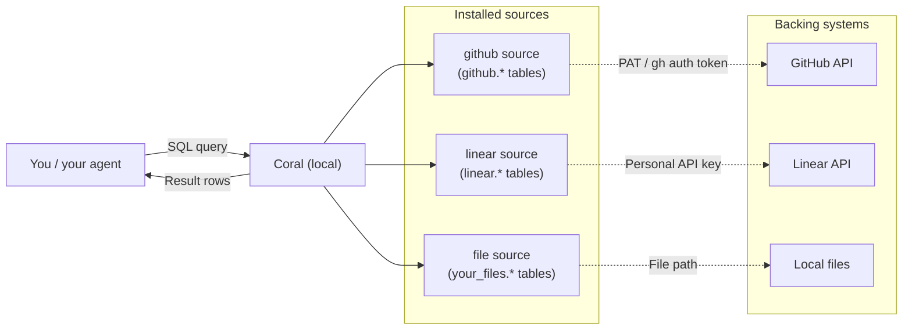

[](https://github.com/withcoral/coral/actions/workflows/validate.yml)
[](https://github.com/withcoral/coral/releases)
[](./LICENSE)
[](https://withcoral.com/docs)
[](https://withcoral.com/discord)
[](https://deepwiki.com/withcoral/coral)

Coral gives agents a local-first capability system over APIs, GraphQL, upstream
MCP servers, files, and other data sources. Query SQL projections from the CLI,
discover generated capabilities with `search` and `describe`, or expose the same
runtime over MCP so agents can use it without bespoke tool glue.

You can ask your agents complex questions about your data:



Or run SQL queries yourself:


## Why Coral

Most agent workflows access company data one tool at a time. That works, but it
tends to create:

- too many tool calls
- repeated auth, pagination, and retry logic
- poor cross-source reasoning
- high token traffic
- brittle glue code and prompts

Coral gives agents one local capability interface instead:

- query multiple live sources through SQL
- keep workflows inspectable and scriptable
- expose the same runtime over MCP
- answer cross-source questions without stitching tools together by hand

We benchmarked Coral with direct provider MCPs (Datadog, Sentry, Linear, Slack and Github) for a diverse set of 82 real-world AI tasks using Claude Opus 4.6. Key findings:

1. **Widespread impact on performance**. Across all tasks, Claude was 20% more accurate and 2x more cost efficient using Coral than using direct provider MCPs. With Coral, Claude also had 42% lower latency.

2. **Highest impact on coding agent tasks**. Across the more complex tasks that typify coding agent workloads (multi-hop, higher post-processing), Claude was 31% more accurate and 3.4x more cost efficient with Coral.

3. **More neutral impact on simpler tasks**. For simpler AI tasks, such as raw fact retrieval from knowledge bases, the results were closer, with Claude 6% more accurate and 2% more cost efficient with Coral.

Full [benchmark report](https://withcoral.com/benchmarks).

## How Coral works

Coral sits between your agents and your data sources: agents discover generated
capabilities, run TypeScript bindings or SQL projections through Code Mode, and
Coral translates those calls into provider API calls or file reads.



**Sources.** A _source spec_ is a YAML file that declares how to reach an API
or local dataset and which tables and columns it exposes. A _source_ is that
spec plus the credentials and variables you configured for it. When you run
`coral source add --file ./messages.source.yaml`, Coral installs the source
declared by that file and exposes it at query time as a SQL schema, such as
`local_messages.messages`. Start with the
[quickstart](https://withcoral.com/docs/getting-started/quickstart) or
[write your own source spec](https://withcoral.com/docs/guides/write-a-custom-source).

**Joins across sources.** Because every source appears as SQL tables, you can
`JOIN` across them in one statement, and Coral executes the join locally
after fetching each side from its backing API or files. For example, to see
which Linear issues are tracking open GitHub pull requests:

```sql
SELECT a.issue_identifier, a.url, p.state
FROM linear.attachments a
JOIN github.pulls p ON p.html_url = a.url
WHERE p.owner = 'withcoral' AND p.repo = 'coral'
```

**Authentication.** On `coral source add`, Coral reads variables and secrets
from matching environment variables, or prompts for them when you pass
`--interactive`. These values are stored locally and used only at query time;
credentials never leave your machine.

**Built for production.** Coral is a read layer by design. For read tasks, SQL
outperforms per-source tool calls when complexity outgrows a single API call:
Coral handles pagination, returns tabular rows instead of sprawling JSON, and
lets the query pick just the columns it needs. Query pushdown and caching
keep things responsive and cut unnecessary API traffic.

For a deeper understanding of the internals, see the
[architecture page](https://withcoral.com/docs/project/architecture).

## Source specs

Coral connects to data through SourceSpec YAML files. SourceSpecs can describe
HTTP APIs, MCP tools, GraphQL endpoints, and local files such as JSONL or
Parquet.

Use `coral source add --file ./my-source.yaml` to install a SourceSpec. If your
build includes active bundled SourceSpecs, `coral source discover` lists them;
otherwise, start with the
[quickstart](https://withcoral.com/docs/getting-started/quickstart) or
[write a custom source](https://withcoral.com/docs/guides/write-a-custom-source).

## Quickstart

This gets you from a fresh [install](https://withcoral.com/docs/getting-started/installation)
of Coral to your first SQL query. If you prefer an interactive wizard, you can run
`coral onboard`, which guides you through everything covered below.

### 1. Install Coral

On macOS:

```bash
brew install withcoral/tap/coral
```

Or on Linux:

```bash
curl -fsSL https://withcoral.com/install.sh | sh
```

Or on Windows 10/11 x86_64, download
`coral-x86_64-pc-windows-msvc.zip` from the latest GitHub release and put
`coral.exe` on your `PATH`.

See [all install options](https://withcoral.com/docs/getting-started/installation).

### 2. Create a SourceSpec

```bash
mkdir -p /tmp/coral-quickstart
printf '{"id":1,"text":"hello"}\n{"id":2,"text":"world"}\n' > /tmp/coral-quickstart/messages.jsonl
cat > /tmp/coral-quickstart/messages.source.yaml <<'YAML'
spec_version: 1
kind: source
name: local_messages
interfaces:
  - id: messages
    type: file
    files:
      - ./messages.jsonl
    format:
      kind: jsonl
YAML
```

This defines a local JSONL file source.

### 3. Add a source

```bash
coral source add --file /tmp/coral-quickstart/messages.source.yaml
```

Once connected, the source's data is available as SQL tables. For SourceSpecs
with declared variables or secrets, Coral reads each input from an environment
variable of the same name, or prompts when you pass `--interactive`.

### 4. Query your data

Use `information_schema.tables` to see available SQL tables:

```bash
coral sql "SELECT table_schema, table_name FROM information_schema.tables WHERE table_schema <> 'information_schema' ORDER BY 1, 2"
```

Query the local JSONL source:

```bash
coral sql "
  SELECT id, text
  FROM local_messages.messages
  ORDER BY id
"
```


### Next steps

- **[Use Coral over MCP](https://withcoral.com/docs/guides/use-coral-over-mcp)** — expose Coral to Claude Code, Cursor, or VS Code over MCP so your agent can query sources directly
- **[Write a custom source spec](https://withcoral.com/docs/guides/write-a-custom-source)** — connect any HTTP API or local dataset that isn't bundled yet
- **[Install Coral skills](https://withcoral.com/docs/getting-started/installation#skills)** — teach your coding agent how to use Coral

## Use Coral with an agent

Coral ships with a built-in MCP server that presents Coral to your agent as a
compact capability interface. Once you've added at least one source, wire Coral
into your agent:

```bash
claude mcp add --scope user coral -- coral mcp-stdio   # Claude Code
codex mcp add coral -- coral mcp-stdio                 # Codex
```

For Cursor, VS Code, Claude Desktop, OpenCode, and manual config examples,
see [Use Coral over MCP](https://withcoral.com/docs/guides/use-coral-over-mcp).

Coral also publishes a set of skills that teach your agent the capability-first
workflow (`search`, `describe`, `exec`, `wait`, and `information_schema` for SQL
inspection):

```bash
npx skills add withcoral/skills
```

Once connected, ask your agent to "list the tables available in Coral" or to run
a small query. It should use `search` and `describe` for capability discovery,
then `coral.sql.query(...)` with `information_schema` or source tables when SQL
projection bindings are visible.

## Local state

Coral stores local state in its platform-specific configuration directory.

You can override the config directory with:

```bash
export CORAL_CONFIG_DIR=/path/to/coral-config
```

Important files include:

- `config.toml` for installed-source metadata and non-secret variables
- imported source specs under `workspaces/<workspace>/sources/<source>/manifest.yaml`
- source secrets stored separately within the same local trust boundary

Imported SourceSpecs are materialized into the local Coral config directory.
Re-run `coral source add --file ./my-source.yaml` when the spec or provider
snapshot changes and you want Coral to regenerate its local artifacts.

## Development

Install the local test runner once with Homebrew:

```bash
brew install cargo-nextest
```

Or install it with Cargo:

```bash
cargo install cargo-nextest --locked
```

Run the workspace validation gate from the repository root:

```bash
make rust-checks
```

## Documentation

For setup guides, reference docs, and examples, visit
[withcoral.com/docs](https://withcoral.com/docs).

## Community

Questions, ideas, and show-and-tell are welcome in our
[Discord](https://withcoral.com/discord) or on
[GitHub issues](https://github.com/withcoral/coral/issues).

## Contributing

Contributions are welcome, especially bug fixes, tests, documentation
improvements, source improvements, and user-facing usability improvements.

Please read [`CONTRIBUTING.md`](./CONTRIBUTING.md) before opening a pull
request.

## Security

Please do not report security issues in public issues or pull requests. See
[`SECURITY.md`](./SECURITY.md).

## Licence

Coral is licensed under the Apache License 2.0. See [`LICENSE`](./LICENSE).
