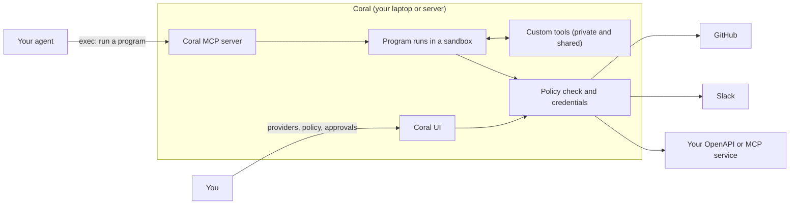

# Coral

**Execution rails for agents.**

Coral gives your agents execution rails for work with sensitive enterprise
systems. It's self-hosted, open source, and you can use it with any agent and
any system with an API.

**Control each call, not just each tool.** Most agent setups decide only which
MCP tools an agent can see. That is all or nothing: if an agent can call
`update_record`, it can update any record in any way the tool allows. Coral
checks every call against your policy before it reaches the system. You allow
it, block it, or require a person to approve that exact call and its
arguments.

**Less duplicated agent work.** Agents start every task from scratch. They
re-read tool schemas, retry failed calls, and spend tokens rewriting code for
steps they got right yesterday. With Coral, agents save the code that worked
as custom tools, and the next agent calls them in one step.

Coral is used by thousands of developers at more than 450 companies for
safer, more efficient agent work in customer support, SecOps, business
intelligence, SRE, and more.

[](https://github.com/withcoral/coral/actions/workflows/ci.yml)
[](./LICENSE)
[](https://withcoral.com/docs)
[](https://withcoral.com/slack)

[Quickstart](https://withcoral.com/docs/getting-started/quickstart) ·
[Download](https://withcoral.com/download)

In this example, an agent posts unreviewed PRs to Slack for the first time. The
agent searches for the GitHub and Slack tools and writes code that calls them.
It isn't allowed to post to Slack without approval, so the user approves the
post. The agent then saves its code as a custom tool. The next day, the agent
runs the same task by calling that custom tool.


## Get started

1. **Install Coral.**
    - **For yourself:** download the desktop app for macOS, Linux, or Windows
      from the [download page](https://withcoral.com/download).
    - **For your team:** [run a shared server](https://withcoral.com/docs/getting-started/self-host)
      with Docker Compose or Kubernetes.
2. **Add a provider.** A provider is one service your agents can use, such as
   GitHub or Linear. Pick one from the catalog, or bring your own OpenAPI
   document or MCP server. By default, tools that read data run right away and
   everything else needs your approval. See
   [Add a provider](https://withcoral.com/docs/getting-started/quickstart#add-a-provider).
3. **Connect your agent.** Copy your workspace's MCP URL from the Coral UI and
   add it to your MCP client:

    ```bash
    claude mcp add --scope user --transport http coral <your-mcp-url>   # Claude Code
    codex mcp add coral --url <your-mcp-url>                            # Codex
    ```

    For Cursor, VS Code, OpenCode, and other clients, see
    [Connect an MCP client](https://withcoral.com/docs/getting-started/quickstart#connect-an-mcp-client).

4. **Ask a question.** Ask your agent something that uses that provider, such
   as "What are my open pull requests?" Once a task works, your agent saves it
   as a custom tool it can call in one step next time.

## Why Coral

MCP tool scopes are often broader than an agent use case requires, and agents
waste time and tokens repeatedly figuring out how to do work that's been done
before. Coral addresses both problems with custom tools. An agent saves code
that worked as a private tool for itself. A workspace owner publishes the best
ones as shared tools that everyone in the workspace can call.

- **Precise control.** Set Allow, Ask, or Block for each provider tool and each
  custom tool. An approval shows the exact call and its arguments, so Security
  approves one refund lookup, not the whole payments API.
- **Cheaper models, same accuracy.** With custom tools, a smaller model
  performs like a bigger one. For many tasks, this means Opus 5.5 accuracy at
  Haiku 5.5 cost.
- **Faster, leaner agents.** Across 34 benchmark tasks, custom tools cut
  tokens by 37%, cost by 31%, and time by 29%.
- **Training data you own.** Each run leaves a structured trace of the goal,
  the tools used, and the outcome that works well for post-training your own
  model.

From one developer's laptop to an enterprise cloud, Coral fits your stack:

- **Runs on your infrastructure.** Coral runs anywhere from a laptop to your
  own cloud, with zero data egress.
- **Open source.** Coral is licensed under the Apache License 2.0. Coral
  Enterprise adds organization-wide governance and support.
- **Any agent, any system.** It works with any AI app or agent that supports
  MCP. You can connect anything with an MCP server or OpenAPI document,
  including more than 5,000 databases and SaaS tools.

## How Coral works

**Agents write programs.** To use tools, an agent writes a short TypeScript
program. One program can call several tools, filter the results, and return
only what the task needs. Less raw data passes through the model's context.

**Coral runs them on rails.** Each program runs in a sandbox, system
credentials never appear in the agent's context or code, and every call is
checked against your policy before it reaches the system behind it. Policies
can also require a person to approve it.

**What works becomes a custom tool.** When a program succeeds, the agent saves
it as a private tool under `coral.private`. Agents find custom tools in the
same search as provider tools, and reuse or edit them instead of starting
over. A workspace owner can publish a private tool as a shared tool under
`coral.shared`, so everyone in the workspace can call it.

**Agents never hold credentials.** Coral stores your tokens and adds them to
each call. Programs run in an isolated sandbox with no secrets, no network
access, and no imports, and every run is attributed to the person or agent
that started it.


```mermaid
graph LR
    Agent["Your agent"] -->|"exec: run a program"| MCP["Coral MCP server"]
    You["You"] -->|"providers, policy, approvals"| UI["Coral UI"]

    subgraph Coral["Coral (your laptop or server)"]
        MCP --> Run["Program runs in a sandbox"]
        Run <--> FN["Custom tools (private and shared)"]
        UI --> Gate["Policy check and credentials"]
        Run --> Gate
    end

    Gate --> GH["GitHub"]
    Gate --> SL["Slack"]
    Gate --> Own["Your OpenAPI or MCP service"]
```

The agent sends Coral programs through the `exec` tool. A program calls
`coral.search` to find the tools the agent can use and read their
TypeScript signatures. Then the agent sends a program that does the work.
This one finds open pull requests that have no reviewer and posts them to
Slack:

```ts
const { data: pulls } = await coral.providers.github.pulls.list({
    owner: "withcoral",
    repo: "coral",
    state: "open",
});

const unreviewed = pulls.filter((pull) => pull.requested_reviewers.length === 0);

await coral.providers.slack.chat.postMessage({
    channel: "#engineering",
    text: unreviewed.map((pull) => `#${pull.number} ${pull.title}`).join("\n"),
});

return unreviewed.map((pull) => pull.number);
```

Coral adds the credentials and checks each call against your policy. If
posting to Slack needs approval, the run pauses there until you approve it.
Only the pull request numbers go back to the agent, not the full GitHub
response. The run happens on the Coral server, not in your agent, so it
carries on even if the agent disconnects.

Once this works, the agent saves the code as a custom tool. Next time, it
calls it in one step as `coral.private.<name>({ ... })`, instead of finding
the tools and writing the code again.

To learn about providers, accounts, policy, and workspaces, read
[Concepts](https://withcoral.com/docs/guides/concepts).

## For teams and enterprise

Coral is open source under the Apache License 2.0. Running it for a team? See
[Run a shared server](https://withcoral.com/docs/getting-started/self-host).

Coral Enterprise adds organization-wide governance and support: SSO with SAML,
SCIM provisioning, advanced RBAC, an immutable audit log, and support SLAs. See
[Coral Enterprise](https://withcoral.com/pricing) or
[book a demo](https://withcoral.com).

## Development

To run Coral from a checkout, follow the
[development guide](./docs/development.md).

## Community

Ask questions, share ideas, and show what you built in our
[Slack community](https://withcoral.com/slack) or on
[GitHub issues](https://github.com/withcoral/coral/issues).

## Security

Do not report security issues in public issues or pull requests. See
[`SECURITY.md`](./SECURITY.md).

Coral is ISO/IEC 27001:2022 certified. Provider API calls run in an isolated
sandbox, approvals are logged, and
[Coral Enterprise](https://withcoral.com/pricing) adds SSO with SAML, SCIM
provisioning, advanced RBAC, and an immutable audit log.

## License

Coral is licensed under the Apache License 2.0. See [`LICENSE`](./LICENSE).

The [`ee/`](./ee) directory holds Enterprise Edition code under its own license,
[`ee/LICENSE`](./ee/LICENSE). A plain `cargo build` at the repository root
builds only code under the Apache License 2.0. [`NOTICE`](./NOTICE) sets out
which license covers which files.

## Upgrade from Coral 0.x

Coral v1 replaces the SQL interface with TypeScript programs. It starts from
fresh state and does not convert what 0.x stored. If Coral finds 0.x state, it
tells you at startup. See
[Upgrade from Coral 0.x](https://withcoral.com/docs/getting-started/self-host#upgrade-from-coral-0-x).
