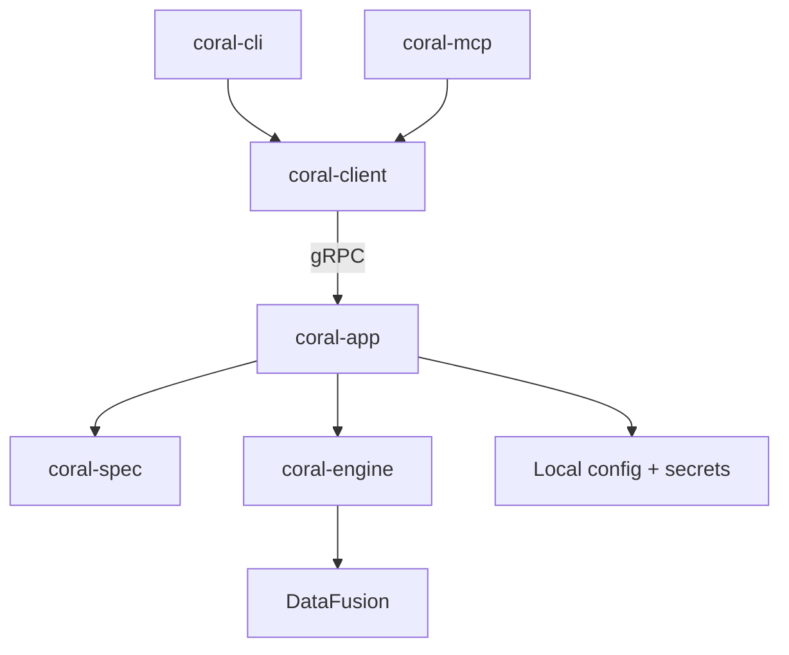

This page is for contributors who want to understand how Coral is structured internally.

## Overview

Coral is split into seven crates. The two entry points — the CLI and the MCP server — share the same runtime through `coral-client` and `coral-app`.



## Request flow

A query follows this path:

1. **Entry point** — a user runs `coral sql` or an agent calls the `sql` MCP tool
2. **`coral-client`** — bootstraps a local gRPC connection to `coral-app` (starting the server if needed) and sends the request
3. **`coral-app`** — loads installed sources from local state, delegates spec validation to `coral-spec`, and hands validated specs to `coral-engine`
4. **`coral-engine`** — compiles specs into DataFusion table providers, registers them in a session, and executes SQL
5. **Result** — Arrow record batches flow back through gRPC to the client, which formats them as table or JSON output (CLI) or structured MCP tool results (MCP)

## Crates

### `coral-cli`

The user-facing command-line interface.

| Owns | Details |
| --- | --- |
| Command parsing | `coral sql`, `coral source`, `coral onboard`, `coral mcp-stdio` |
| Interactive prompts | Variables and secrets during `source add` / `source import` |
| Output formatting | Table and JSON via `coral-client` helpers |

Single file: `main.rs`. Intentionally thin — delegates all business logic to `coral-client`.

### `coral-client`

Shared client library used by both `coral-cli` and `coral-mcp`.

| Owns | Details |
| --- | --- |
| Local transport | Starts or connects to the `coral-app` gRPC server |
| Result decoding | Arrow IPC → record batches |
| Formatting helpers | `format_batches_table`, `format_batches_json` |

### `coral-app`

The local server and core orchestrator.

| Owns | Details |
| --- | --- |
| Server bootstrap | In-process gRPC server lifecycle (`bootstrap/`) |
| Source management | Install, import, list, validate, remove (`sources/`) |
| Workspace state | Config, secrets, and workspace layout (`state/`, `storage/`) |
| Query orchestration | Loads sources, builds the engine, executes SQL (`query/`) |

This is the largest crate. It ties `coral-spec` and `coral-engine` together and manages all persistent local state.

### `coral-spec`

Source spec parsing and validation.

| Owns | Details |
| --- | --- |
| YAML parsing | Deserializes source specs into typed Rust structs |
| Validation | Structural invariants, required fields, backend-specific rules (`validate.rs`) |
| Input discovery | Extracts required variables and secrets from specs (`inputs.rs`) |
| Backend-specific models | HTTP, JSONL, Parquet spec shapes (`backends/`) |

Produces a validated spec model that `coral-engine` consumes. No runtime or I/O — pure data transformation.

### `coral-engine`

Query execution engine.

| Owns | Details |
| --- | --- |
| Backend compilation | Turns validated specs into DataFusion `TableProvider` implementations (`backends/`) |
| Runtime registry | Registers table providers into a DataFusion session (`runtime/`) |
| Query contracts | Engine-facing types for catalog and query results (`contracts/`) |
| Backend implementations | HTTP, JSONL, Parquet backends (`backends/http`, `backends/jsonl`, `backends/parquet`) |

### `coral-mcp`

The MCP stdio server.

| Owns | Details |
| --- | --- |
| MCP protocol | Tool and resource handlers via the `rmcp` SDK (`server.rs`) |
| Surface shaping | Tool descriptions, guide template, result formatting (`surface.rs`) |
| Tools | `sql`, `list_tables` |
| Resources | `coral://guide`, `coral://tables` |

Uses `coral-client` to reach `coral-app` — same transport as the CLI.

### `coral-api`

The shared gRPC contract.

| Owns | Details |
| --- | --- |
| Protobuf definitions | `proto/coral/v1/` — `query.proto`, `sources.proto`, `catalog.proto`, `resources.proto` |
| Generated bindings | Tonic-generated Rust types and service traits |

All inter-crate communication between `coral-client` and `coral-app` goes through these generated types.

## Dependency graph

```
coral-cli ──► coral-client ──► coral-api
coral-mcp ──► coral-client        │
                                  ▼
                            coral-app
                            ┌────┴────┐
                            ▼         ▼
                       coral-spec  coral-engine
```

`coral-spec` and `coral-engine` do not depend on each other. `coral-app` is the integration point that connects them.

## Key design choices

- **Local gRPC server.** The CLI and MCP server don't embed the engine directly — they go through a local gRPC server managed by `coral-app`. This keeps the engine lifecycle in one place and makes the client/server boundary explicit.
- **Spec vs engine separation.** `coral-spec` is pure validation (no I/O, no runtime). `coral-engine` is pure execution (no YAML parsing, no persistence). `coral-app` bridges the two.
- **Single workspace.** Today, all state is scoped to a single local workspace. The workspace model exists in the code (`workspaces/`) but the multi-workspace surface is not yet exposed.
