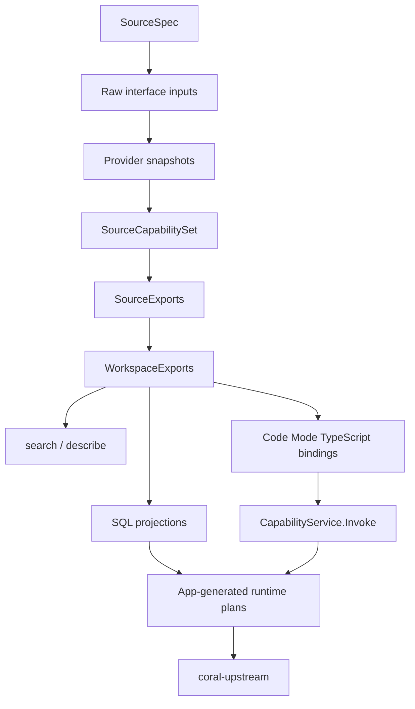
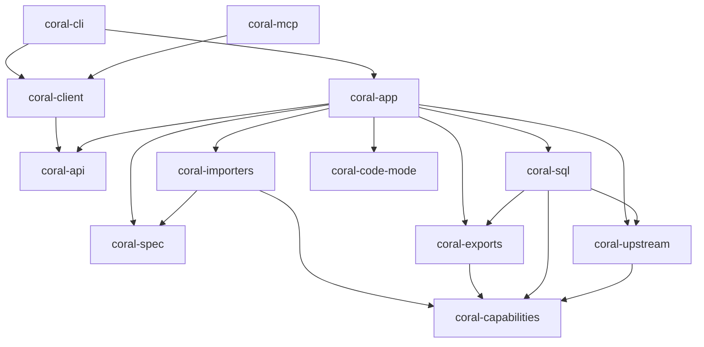

## Overview

Coral materializes provider sources into a capability-first package, then builds
product surfaces from that package.

SQL is first-class, but it is a projection of capabilities, not the primitive
source model. The durable source artifacts are provider snapshots,
`capabilities.yaml`, and `exports/source-exports.yaml`. Runtime plans are built
by `coral-app` from installed artifacts, current credentials, and feature flags.

## Crates

### `coral-cli`

The terminal adapter. It owns command parsing, interactive source input
collection, and terminal rendering. It keeps source lifecycle, SourceSpec
semantics, SQL execution, capability invocation, and Arrow IPC details in the
inner crates.

### `coral-client`

The API transport and result helper crate. It builds generated gRPC clients for
an existing endpoint, decodes Arrow IPC query results, formats table/JSON
output, and decodes structured transport errors. It does not bootstrap local
servers or depend on app/source/runtime crates.

### `coral-app`

The local composition root. It owns server bootstrap, workspaces, config,
credentials, source lifecycle, materialization, installed artifact loading,
workspace export composition, discovery search/describe, capability invocation,
SQL orchestration, and Code Mode service lifecycle.

Local process entry points that need in-process server control use
`coral_app::ServerBuilder`; transport callers use `coral-client`.

### `coral-spec`

The SourceSpec parser and validator. It accepts `spec_version: 1`,
`kind: source`, source inputs, and `openapi`, `mcp`, `graphql`, and `file`
interfaces. It rejects removed source-contract keys before deserializing. It
does not import provider documents, generate capabilities, derive projections,
execute providers, or know about app state.

### `coral-importers`

Provider import and capability generation. It parses raw OpenAPI documents,
upstream MCP `tools/list` snapshots, GraphQL SDL/introspection snapshots, and
explicit file source facts into provider snapshots, then derives
`SourceCapabilitySet` values.

### `coral-capabilities`

Provider-neutral capability contracts: stable capability ids, invocation
schemas, effect profiles, credential requirements, upstream binding facts,
shape hints, output contracts, provenance, and diagnostics. It has no Coral
crate dependencies.

### `coral-exports`

Generated source/workspace export contracts. It owns `SourceExports`,
`WorkspaceExports`, the binding contributor port, TypeScript binding metadata,
SQL binding metadata structs, search items, describe resolution, export refs,
and collision handling. It does not depend on SQL execution, app state, MCP, or
provider runtimes.

### `coral-sql`

SQL projection and execution. It implements the SQL binding contributor, derives
and validates SQL projection metadata, registers DataFusion tables/functions,
executes read-only SQL, and converts provider/file results into Arrow rows.
It consumes app-resolved runtime plans; it does not resolve secrets or compose
workspace exports.

### `coral-upstream`

Neutral provider invocation execution. It executes app-built REST, upstream MCP
`tools/call`, and GraphQL HTTP plans and returns provider response envelopes.
It does not resolve credentials, own app state, expose MCP product tools, or
return Arrow.

### `coral-code-mode`

The Code Mode isolate/cell runtime and host bridge contract. It owns execution
lifecycle, stored values, output limits, events, cancellation, and sandbox
boundaries. It calls app services through a host bridge and has no direct
network, filesystem, secret, SQL-runtime, or provider-runtime access.

### `coral-mcp`

The MCP stdio adapter over `coral-client`. It exposes a small stable agent
surface: `search`, `describe`, `exec`, `wait`, and `feedback`. It
does not expose direct SQL tools, catalog tools, or raw capability calls. SQL runs
inside Code Mode through `coral.sql.query(...)`.

### `coral-api`

The protobuf contract and generated Rust bindings for local transport:
generated-export discovery, SQL execution, capability invocation, Code Mode,
source management, and feedback.

## Request Flow

Source add/materialization:

1. `coral-cli` or another local entry point asks `coral-app` to add a source.
2. `coral-spec` parses and validates the SourceSpec.
3. `coral-app` resolves declared inputs and acquires raw interface inputs.
4. `coral-importers` builds provider snapshots and a `SourceCapabilitySet`.
5. `coral-exports` and `coral-sql` contribute TypeScript and SQL bindings.
6. `coral-app` validates and atomically installs provider snapshots,
   generated GraphQL operation documents, `capabilities.yaml`, and
   `exports/source-exports.yaml`.

MCP discovery and execution:

1. An MCP client calls `search` or `describe`.
2. `coral-mcp` forwards to `DiscoveryService` through `coral-client`.
3. `coral-app` composes current `WorkspaceExports` and returns typed refs,
   capability ids, effect-profile metadata, diagnostics, and SQL projection
   metadata when available.
4. The agent runs Code Mode through `exec` and `wait`.
5. Code Mode generated methods under `tools.*` call `CapabilityService.Invoke`;
   SQL uses `coral.sql.query(...)`.

SQL execution:

1. CLI `coral sql` or Code Mode `coral.sql.query` calls `SqlService`.
2. `coral-app` loads installed capabilities/exports and resolves the referenced
   SQL binding metadata.
3. `coral-sql` executes the read-only query through DataFusion.
4. Provider-backed scans use app-built runtime plans and `coral-upstream`; file
   scans use trusted installed file refs.
5. Arrow record batches return through `coral-api` and `coral-client`.

Capability invocation:

1. A generated TypeScript method calls `CapabilityService.Invoke` with a
   captured capability id and binding ref from `search`/`describe` metadata.
2. `coral-app` revalidates the capability, binding, source existence, and
   credentials before network.
3. `coral-app` builds an `UpstreamInvocationPlan` or file-read plan.
4. `coral-upstream` executes REST, upstream MCP, or GraphQL calls and returns a
   provider envelope.

## Dependency Graph

`coral-capabilities` has no Coral crate dependencies. `coral-exports` owns the
binding contributor port and must not depend on `coral-sql`. `coral-client`
does not depend on `coral-app`.

## Key Design Choices

- **Capability center.** Provider snapshots and capabilities are the source
  truth. SQL, TypeScript, MCP, and Code Mode are export/runtime surfaces.
- **App-owned authority.** `coral-app` owns installed source identity,
  workspace exports, credential resolution, mutation gating, and runtime plan
  assembly.
- **No silent regeneration.** Query and invocation load installed artifacts and
  fail closed when required generated artifacts are missing or incompatible.
- **Small MCP surface.** MCP discovers and runs Code Mode. Direct SQL/catalog
  tools are intentionally absent from MCP; one-shot capability invocation lives
  in the CLI through `coral invoke`.
